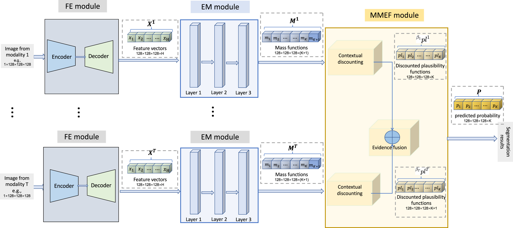
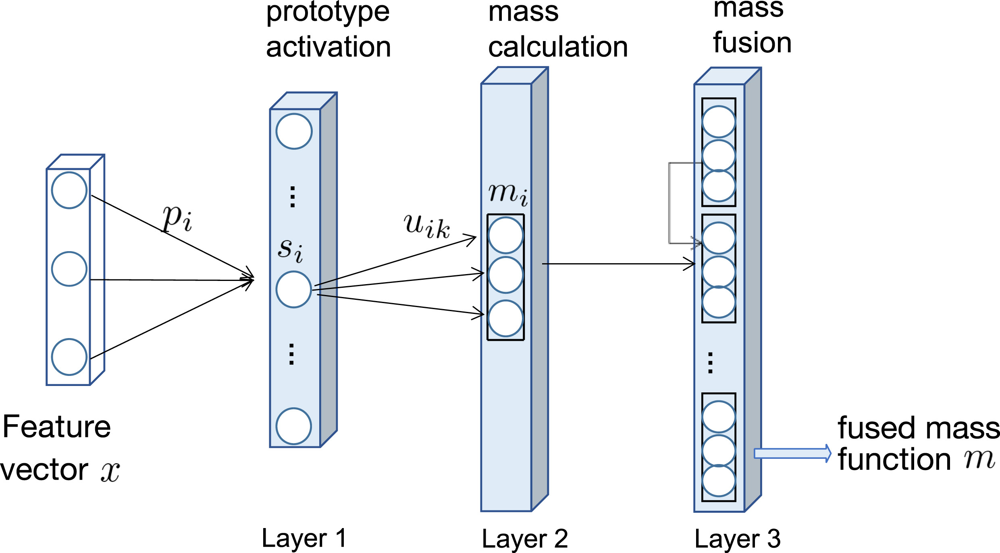

The paper we choise to present is : **Deep Evidential Fusion with Uncertainty Quantification for Multimodal Medical Image Segmentation**

---

## 1. **Introduction (2 minutes)**
  In clinical practice, different imaging modalities like PET, CT or MRI sequences are often used together to provide a more comprehensive understanding of a patient's condition. For example, PET images are effective at highlighting metabolic activity, whereas CT images are better at showing anatomical structures. By combining these two, we can achieve a more accurate diagnosis and understand the condition better.

 However, there is a major challenge. Traditional methods for segmenting multimodal images often assume that all sources are equally reliable. But, in reality, each imaging modality may have different levels of quality, resolution, and reliability. Relying on these equally can lead to errors in segmentation, which ultimately affects the diagnosis.

 This paper aims to address this issue by proposing a deep evidential fusion framework. This approach leverages Dempster-Shafer Theory to quantify both the uncertainty and the reliability of each imaging modality. This way, we can achieve a more accurate and explainable segmentation result, thus leading to better clinical decisions.

 ### PPT Short Phrases Version

    Multimodal Medical Imaging:

        PET-CT/MRI: Complementary information.

        PET: Highlights metabolic activity.

        CT: Shows anatomical structures.

        Combined: More accurate diagnoses.

    Problem:

        Traditional fusion methods: Assume equal reliability.

        Real-world variation: Quality, resolution, reliability.

        Result: Potential segmentation errors.

    Aim:

        Deep evidential fusion framework.

        Uses Dempster-Shafer Theory.

        Models uncertainty and reliability.

        Goal: More accurate, explainable segmentation.

---

## 2. **Proposed framework ( minutes)**



The framework proposed by this paper can be devided into 3 modules as depicted in the picture: 
- a Feature Extraction module (FE)
- an Evidence Mapping module (EM)
- and a Multi-modality Evidence Fusion module (MMEF)

Each modality has its own FE+EM+MMEF.

### 2.1 **Feature Extraction (FE)**:

First, the framework uses deep learning models like UNet or nnFormer as the FE module to extract relevant features from each modality independently.

For example, suppose we input an image of size 128x128x128 as a single-channel grayscale image into the FE module. The output will be an image with the same spatial size but with H channels instead of a single channel. In other words, we extract H-dimensional features, where H is the number of features computed at each voxel.

⨻ In this paper, H is set to 2 for the PET-CT lymphoma dataset and 4 for the multi-MRI BraTS2021 dataset.

#### ppt

```
Feature Extraction Module (FE):

  - Deep learning models: UNet, nnFormer.

  - Independent feature extraction per modality.

  - Example: 

    -  Input: 128x128x128 single-channel image.

    -  Output: H-channel image (same spatial size).

  - H values:

    -  PET-CT lymphoma dataset: H = 2.

    -  Multi-MRI BraTS2021 dataset: H = 4.

```

### 2.2 **Evidence Mapping (EM)**:

These extracted features are transformed into mass functions using the Evidential Neural Network (ENN) module.



The output mass functions represent evidence about the class of each voxel, resulting in a tensor of size 128x128x128x(K+1), where K+1 is the number of masses (one for each class $\theta_k$ and one for the frame of discernment $\Theta$).

The figure above shows the structure of the ENN module, which consists of a prototype activation layer, a mass calculation layer, and a combination layer.


#### 2.2.1 Prototypes $p_i$ in the space of features extracted by the FE module

Prototypes are obtained by running the k-means algorithm in the space of features extracted by the FE module; let's assume there are I prototypes: $p_1^t, \dots, p_I^t$.

⨻ In this paper, I is set to 10 for the PET-CT lymphoma dataset and 20 for the multi-MRI BraTS2021 dataset.

#### 2.2.2 $s_i^t$: Similarity between input feature vector $x$ and prototype $p_i^t$
- The activation of unit i in the prototype layer is

$$
s_i^t = \alpha_i^t \exp\left(-\gamma_i^t \|x - p_i^t\|^2\right), \quad \gamma_i^t > 0, \quad \alpha_i^t \in [0, 1]
$$

$\gamma_i^t$ and $\alpha_i^t$ are learnable parameters (in this paper, they are initialised as 0.5 and 0.01, respectively). $s_i^t$ reflects the similarity between the input feature vector $x$ and prototype $p_i^t$.

#### 2.2.3 $m_i$: Mass function obtained from reliability discounting of $s_i^t$

Next, a second hidden layer is used to compute the mass function $m_i^t$, which represents the belief provided by prototype $p_i^t$. The focal sets of $m_i^t$ are singletons $\theta_k$ ($k=1, \dots, K$, where K is the number of label types, or classes) and the universal set $\Theta$. The mass function is defined as follows:

$$
m_i^t(\{\theta_k\}) = u_{ik}^t s_i^t, k=1, \dots, K,
$$
$$
m_i^t(\Theta) = 1-s_i^t
$$

where $u_{ik}^t$ is a learnable parameter that represents the membership degree of prototype $p_i^t$ to class $\theta_k$. In this paper, it is initialised by drawing from uniform random numbers and normalizing.

#### 2.2.4 $\oplus^I_{i=1} m_i^t$ : Fusing mass functions to summarise evidence provided by I prototypes

Finally, in the third hidden layer, the I mass functions are combined using Dempster's rule to provide a comprehensive opinion on the fused mass function $m$ for input feature vector $x$.

Dempster's rule: 
$$
(m_1 \oplus m_2)(A) = \frac{1}{1-\kappa}\sum_{B\cap C=A} m_1(B) m_2(C)
$$
$$
\kappa = \sum_{B\cap C= \emptyset }m_1(B) m_2(C)
$$


## 2.3 **Multi-modality Evidence Fusion (MMEF)**:

After gathering evidence from each modality, the next step is to fuse them. Instead of fusing at the mass function level, MMEF fuses at the contour function level, which helps facilitate the plausibility-probability transformation. These contour functions are contextually discounted using T discounting vectors (reliability) $\beta = (\beta^1, \dots, \beta^T)$, $\beta^t = \left ( \beta_1^t, \dots, \beta_K^t \right )$, representing the degree of belief that modality t is reliable when the actual class of voxel n is $\theta_k$. The KT reliability coefficients in $\beta$ are learnable parameters, initialized to 0.5 in this paper.

1. Fusion evidence gathered from each modality on contour function level:

1.1\) Contour function for voxel n and modality t:
$$
pl^t_n\left ( \theta_k \right )  = m^t_k\left (\left \{ \theta_k \right \} \right ) + m^t_n \left ( \Theta \right )
$$

1.2\) Discounted contour function for voxel n and modality t:
$$
^{\beta^t} pl^t_n \left ( \theta_k \right ) = 1 - \beta^t_k + \beta^t_k pl^t_n \left ( \theta_k \right )
$$

1.3\) Combining contour function at vocel n:
$$
^{\beta}pl_n(\theta_k) \propto \prod_{t=1}^{T} {^{\beta^t}pl_n^t(\theta_k)},  k=1, \dots, K
$$


2. Transform plausibility into predicted probability:
$$
^{\beta} p_n(\theta_k) = \frac{^{\beta} pI_n(\theta_k)}{\sum_{l=1}^{K} {^{\beta} pI_n(\theta_l)}}
= \frac{\prod_{t=1}^{T} \left( 1 - \beta^t_k + \beta^t_k pI^t_n(\theta_k) \right)}{\sum_{l=1}^{K} \prod_{t=1}^{T} \left( 1 - \beta^t_l + \beta^t_l pI^t_n(\theta_l) \right)}
, k = 1, \dots, K
$$


---
## 3 Loss function

The framework proposed by the paper is optimised by minimising the following loss function:
$$
loss = loss_s + loss_f
$$

- $\text{loss}_s = \sum_{t=1}^{T} \left[ 1 - \frac{2 \sum_{n=1}^{N} \sum_{k=1}^{K} m_n^t(\{\theta_k\}) \times G_{kn}}{\sum_{n=1}^{N} \sum_{k=1}^{K} \left( m_n^t(\{\theta_k\}) + G_{kn} \right)} \right]$ 
evaluates the segmentation performance of each modality individually and then aggregates these performances.


- $\text{loss}_f = 1 - \frac{2 \sum_{n=1}^{N} \sum_{k=1}^{K} {^{\beta} p_n(\theta_k)} \times G_{kn}}{\sum_{n=1}^{N} \sum_{k=1}^{K} {^{\beta} p_n(\theta_k)} + G_{kn}}$ is used to quantify the segmentation performance after combining all T modalities.

Where $N$ is the number of voxels, and $G_{kn} = 1$ if voxel $n$ belongs to class $\theta_k$, otherwise $G_{kn} = 0$.

---
## 4. Learnable parameters
- FM module：weights
- EM module：$\alpha_i^t, \gamma_i^t, u_{ik}^t$
- MMEF module: $\beta$
---
## 5. Training Process

1. Train the FE module independently.

2. After training the FE module, fix the weights and optimize the EM and MMEF modules.

3. Train the combined model (FE + EM + MMEF) together for a few epochs to perform fine-tuning.

---

## 5. **Experimental Results ( minutes)**
   <!-- - **Datasets**:
     - The framework was tested on:
       - **PET-CT lymphoma dataset**: PET provides functional insights, while CT offers structural details.
       - **BraTS2021 multi-MRI dataset**: Consisting of different MRI modalities (FLAIR, T1Gd, T1, T2), this dataset required more complex segmentation of brain tumors.
   - **Performance**:
     - The **MMEF-UNet** model, which incorporates DST, outperformed other models such as UNet, UNet-MC, and ENN-UNet in terms of Dice score and uncertainty quantification metrics like ECE (Expected Calibration Error) and Brier score.
     - **Interpretability**: The learned reliability coefficients also give insights into which modality contributed more to the final segmentation decision. -->

---

## 6. **Conclusion (1 minute)**
   <!-- - **Summary**:
     - The paper presents a novel **deep evidential fusion framework** that uses **Dempster-Shafer theory** to solve the problem of multimodal medical image segmentation.
     - By integrating the **DST-based evidence mapping** and **reliability learning**, the framework not only improves segmentation accuracy but also provides a way to quantify uncertainty, which is crucial in medical applications.
   - **Future Work**:
     - The authors suggest further research could explore more complex medical datasets or different applications where multimodal fusion and uncertainty quantification are critical. -->

