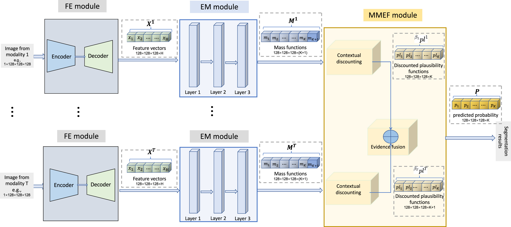

The paper we choise to present is : **Deep Evidential Fusion with Uncertainty Quantification for Multimodal Medical Image Segmentation**

---

## 1. **Introduction (2 minutes)**
   - **Overview of Multimodal Medical Imaging**:
     - Multimodal medical images, such as PET-CT or MRI sequences, provide complementary information about patients' conditions. For instance, PET images highlight metabolic activity, while CT images show anatomical structures. These images, when used together, allow for more accurate diagnoses.
   - **The Problem**:
     - Traditional fusion methods for segmenting multimodal medical images often assume that all data sources are equally reliable. However, real-world medical images vary in quality, resolution, and their relative reliability, and relying on them equally can lead to inaccurate segmentation and diagnosis.
   - **The Aim of the Paper**:
     - This paper proposes a **deep evidential fusion framework** to address this issue by using **Dempster-Shafer theory** (DST), which models both data uncertainty and reliability, providing a more accurate and explainable segmentation.

---

## 2. **Proposed framework ( minutes)**

The framework proposed by this paper can be devided into 3 modules as depicted in the picture: 
- a Feature Extraction module (FE)
- an Evidence Mapping module (EM)
- and a Multi-modality Evidence Fusion module (MMEF)

Each modality has its own FE+EM+MMEF.

### 2.1 **Feature Extraction (FE)**:
- First, the framework uses deep learning models like UNet or nnFormer as the FE module to extract relevant features from each modality independently.
- For example, 假设我们输入FE的图像为大小为128x128x128的单通道灰度图，那么我们通过FE后得到的输出为一个空间大小不变，单通道变为H通道的图像，即，我们提取出的特征是H维度的，H is the number of features computed at each voxel.
- \* 在本文中，对于PET-CT lymphoma dataset，H被设置为2；对于multi-MRI BraTS2021, H被设置为4.

### 2.2 **Evidence Mapping (EM)**:
- These extracted features are transformed into **mass functions** using the **Evidential Neural Network (ENN)** module.
     <!-- , which assigns levels of belief (mass) to each possible class (e.g., tumor, non-tumor). -->

outputs mass functions representing evidence about the class of each voxel, resulting in a tensor of size 128X128X128X(K+1), where K+1 is the number of masses (one for each class $\theta_k$ and one for the frame of discernment $\Theta$).

- 上图展示了ENN module的结构，它由一个proptotype activation layer, 一个 mass calculation layer和一个combination layer构成。

#### 2.2.1 Prototypes $p_i$ in the space of features extracted by the FE module
- prototypes是通过The k-means algorithm is run in the space of features extracted by the FE module得到的; 我们设一共有I个prototypes: $p_1^t, \dots, p_I^t$。

- \* 在本文中，对于PET-CT lymphoma dataset，I被设置为10；对于multi-MRI BraTS2021, I被设置为20.

#### $s_i$: 输入特征向量$x$与prototype $p_i^t$之间的相似度
- The activation of unit i in the prototype layer is

$$
s_i^t = \alpha_i^t \exp\left(-\gamma_i^t \|x - p_i^t\|^2\right), \quad \gamma_i^t > 0, \quad \alpha_i^t \in [0, 1]
$$

$\gamma_i^t$和$\alpha_i^t$是learnable parameters（本文中，它们被初始化为0.5和0.01）。$s_i^t$反映了输入特征向量$x$与prototype $p_i^t$之间的相似度。

#### 2.2.2 $m_i$: 使用$s_i$进行reliability discount得到的mass function
- 而后，使用第二个隐藏层来计算mass function $m_i^t$，$m_i^t$代表了prototype $p_i^t$作为证据提供的意见，$m_i^t$的focal sets是singletons $\theta_k$（k=1,...K，K为图上标签的类型数目）和全集$\Theta$。$m_i^t$ 的定义如下：

$$
m_i^t(\{\theta_k\}) = u_{ik}^t s_i^t, k=1, \dots, K,
$$
$$
m_i^t(\Theta) = 1-s_i^t
$$

其中，$u_{ik}^t$是learnable parameter，它反映了membership degree of prototype $p_i^t$ to class $\theta_k$。本文中，它的初始化是通过“initialised randomly by drawing from uniform random numbers and normalising”来实现的。

#### 2.2.3 $\oplus^I_{i=1} m_i^t$ : fuse the mass functions to summarise the evidence provided by the I prototypes

- finally, 在第三个隐藏层上，我们将I个mass function通过Dempster's rule进行结合得到所有证据对于输入特征向量x的综合性意见the fused mass function m.

Dempster's rule: 
$$
(m_1 \oplus m_2)(A) = \frac{1}{1-\kappa}\sum_{B\cap C=A} m_1(B) m_2(C)
$$
$$
\kappa = \sum_{B\cap C= \emptyset }m_1(B) m_2(C)
$$

## 2.3 **Multi-modality Evidence Fusion (MMEF)**:
After evidence is gathered from each modality, 接下来便是要将这些evidence再进行融合。however，instead of 在mass function的层面上进行融合，MMEF是在contour function 层面上进行融合的，这将有利于后续的plausibility-probability transformation；并且，这些contour function是被contextually discounted的。具体而言，文中使用了T个 vectors of discounting (reliability) $\beta = (\beta^1, \dots, \beta^T)$, $\beta^t = \left ( \beta_1^t, \dots, \beta_K^t \right ) $, 这个向量代表了degree of belief that the modality t is reliable when it is known that the actual class of voxel n is $\theta_k$. The KT reliability coefficients in $\beta$ 是learnable parameters （在本文的语境下被初始化为0.5）。

1. Fusion evidence gathered from each modality on contour function level:

1.1\) Contour function for voxel n and modality t:
$$
pl^t_n\left ( \theta_k \right )  = m^t_k\left (\left \{ \theta_k \right \} \right ) + m^t_n \left ( \Theta \right )
$$

1.2\) Discounted contour function for voxel n and modality t:
$$
^{\beta^t} pl^t_n \left ( \theta_k \right ) = 1 - \beta^t_k + \beta^t_k pl^t_n \left ( \theta_k \right )
$$

1.3\) Combining contour function at vocel n:
$$
^{\beta}pl_n(\theta_k) \propto \prod_{t=1}^{T} {^{\beta^t}pl_n^t(\theta_k)},  k=1, \dots, K
$$

2. Transform plausibility into predicted probability:
$$
^{\beta} p_n(\theta_k) = \frac{^{\beta} pI_n(\theta_k)}{\sum_{l=1}^{K} {^{\beta} pI_n(\theta_l)}}
= \frac{\prod_{t=1}^{T} \left( 1 - \beta^t_k + \beta^t_k pI^t_n(\theta_k) \right)}{\sum_{l=1}^{K} \prod_{t=1}^{T} \left( 1 - \beta^t_l + \beta^t_l pI^t_n(\theta_l) \right)}
, k = 1, \dots, K
$$

---
## 3 Loss function

The framework proposed by the paper is optimised by minimising the following loss function:
$$
loss = loss_s + loss_f
$$

- $\text{loss}_s = \sum_{t=1}^{T} \left[ 1 - \frac{2 \sum_{n=1}^{N} \sum_{k=1}^{K} m_n^t(\{\theta_k\}) \times G_{kn}}{\sum_{n=1}^{N} \sum_{k=1}^{K} \left( m_n^t(\{\theta_k\}) + G_{kn} \right)} \right]$ 用以量化每一个模态的segmentation performance的加和

- $\text{loss}_f = 1 - \frac{2 \sum_{n=1}^{N} \sum_{k=1}^{K} {^{\beta} p_n(\theta_k)} \times G_{kn}}{\sum_{n=1}^{N} \sum_{k=1}^{K} {^{\beta} p_n(\theta_k)} + G_{kn}}$ 用以量化在combine了T个modality后的segmentation performance。

其中，$N$是voxels的个数；$G_kn=1$当vocel n 属于类别$\theta_k$，否则等于0。

---
## 4. Learnable parameters
- FM module：weights
- EM module：$\alpha_i^t, \gamma_i^t, u_{ik}^t$
- MMEF module: $\beta$
---
## 5. 训练过程

1）FM 单独进行训练。

2）FM训练完成后固定weights, 优化EM和MMEF。

3）FM+EM+MMEF 合体一起训练几个epoch进行fine tune。

---

## 5. **Experimental Results ( minutes)**
   <!-- - **Datasets**:
     - The framework was tested on:
       - **PET-CT lymphoma dataset**: PET provides functional insights, while CT offers structural details.
       - **BraTS2021 multi-MRI dataset**: Consisting of different MRI modalities (FLAIR, T1Gd, T1, T2), this dataset required more complex segmentation of brain tumors.
   - **Performance**:
     - The **MMEF-UNet** model, which incorporates DST, outperformed other models such as UNet, UNet-MC, and ENN-UNet in terms of Dice score and uncertainty quantification metrics like ECE (Expected Calibration Error) and Brier score.
     - **Interpretability**: The learned reliability coefficients also give insights into which modality contributed more to the final segmentation decision. -->

---

## 6. **Conclusion (1 minute)**
   <!-- - **Summary**:
     - The paper presents a novel **deep evidential fusion framework** that uses **Dempster-Shafer theory** to solve the problem of multimodal medical image segmentation.
     - By integrating the **DST-based evidence mapping** and **reliability learning**, the framework not only improves segmentation accuracy but also provides a way to quantify uncertainty, which is crucial in medical applications.
   - **Future Work**:
     - The authors suggest further research could explore more complex medical datasets or different applications where multimodal fusion and uncertainty quantification are critical. -->

