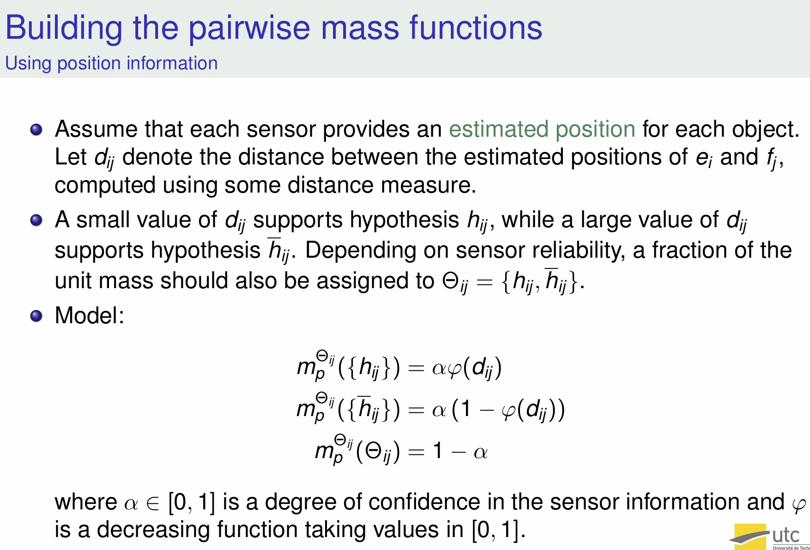

# Deep evidential fusion with uncertainty quantification and reliability learning for multimodal medical image segmentation
带有 不确定性量化 和 可靠性学习 的 多模态医学图像分割 的深度证据融合

The paper uses the **Dempster-Shafer theory of evidence** to solve the problem of **multimodal medical image segmentation**, which is crucial for comprehensive diagnostic assessment in medical imaging. Here's how the theory is applied:

1. **Deep Evidential Fusion**: The method first extracts features from different imaging modalities (such as MRI or PET/CT) using a deep neural network. These features are then converted into **mass functions** based on Dempster-Shafer theory, where the mass functions represent the amount of evidence that supports each class label (e.g., tumor or non-tumor).

2. **Contextual Discounting**: The mass functions are adjusted by a process called **contextual discounting**, which involves learning **reliability coefficients** for each modality. These coefficients quantify how trustworthy the information from each modality is for each specific class. For example, PET might be more reliable for identifying certain active tumors, while CT might be better for anatomical details.

3. **Combining Evidence**: After adjusting the mass functions, the evidence from each modality is combined using **Dempster’s rule of combination**, which merges the information to create a unified decision regarding each voxel in the image. This fusion of evidence improves the segmentation accuracy and provides a more reliable diagnosis.

4. **Uncertainty Quantification**: The framework also allows for **uncertainty quantification**, helping to identify how confident the system is in its segmentation predictions. This is particularly important in medical imaging, where uncertainty can guide further clinical actions.

This framework was tested on PET-CT and MRI datasets for **tumor segmentation**, showing improvements in both **segmentation accuracy** and **uncertainty quantification** compared to traditional methods【5†source】.

这篇文章利用了**Dempster-Shafer证据理论**来解决**多模态医学图像分割**的问题，具体步骤如下：

1. **深度证据融合**：首先使用深度神经网络从不同的成像模态（例如MRI或PET/CT）中提取特征。这些特征被转换为基于Dempster-Shafer理论的**质量函数**，这些函数表示每个类别标签（例如，肿瘤或非肿瘤）所支持的证据量。

2. **上下文折扣**：质量函数通过**上下文折扣**进行调整，学习到的**可靠性系数**会为每个模态和每个类别量化其信息的可信度。例如，PET可能在识别活跃肿瘤方面更为可靠，而CT在提供解剖细节方面更为准确。

3. **证据融合**：调整后的质量函数会通过**Dempster组合规则**进行融合，从而整合来自不同模态的信息，生成关于图像中每个体素的统一决策。通过这种证据融合，提高了分割的准确性，提供了更可靠的诊断结果。

4. **不确定性量化**：该框架还支持**不确定性量化**，帮助识别系统在分割预测中的置信度。这对于医学影像尤为重要，因为不确定性可以引导进一步的临床决策。

这套框架在PET-CT和MRI数据集上的**肿瘤分割**测试中，展示了相比传统方法的改进，不仅在**分割准确性**上有所提高，还增强了**不确定性量化**的能力【5†source】。

---

# Abstract

单模态医学图像通常无法提供足够的信息来做出准确且可靠的诊断。因此，医生通常依赖多模态医学图像进行全面的诊断评估。本研究引入了一种用于多模态医学图像分割的深度证据融合框架，结合了Dempster-Shafer证据理论和深度神经网络。在该框架中，首先使用深度神经网络从每种成像模态中提取特征，并将这些特征映射到Dempster-Shafer质量函数上，描述每个模态在每个体素上的证据。接着，质量函数通过上下文折扣操作进行修正，使用学习到的系数量化每个信息源相对于各类的可靠性。然后，来自各个模态的折扣证据通过Dempster组合规则进行融合。在PET-CT数据集（用于淋巴瘤分割）和多模态MRI数据集（用于脑肿瘤分割）上进行了实验。结果表明，所提出的融合方案能够量化分割的不确定性并提高分割的准确性。此外，学习到的可靠性系数揭示了每个模态在分割过程中所作贡献的一些见解。

---

# 1. Introduction

近年来，医学成像技术的进步促进了多模态数据的获取，如正电子发射断层扫描（PET）/计算机断层扫描（CT）和多序列磁共振成像（MRI）。单一模态的图像只能提供人体内癌症及其他异常部分的信息，而**多模态医学图像分析**通过整合不同成像模态的信息，显著有助于对复杂医疗状况的全面理解【1】。这包括病理结构的位置、大小和范围等因素。基于多模态医学信息融合的医学图像分割可以帮助临床医生更好地勾画解剖结构、病灶和异常，从而提高疾病检测、诊断和治疗计划的效果。

多模态医学图像融合策略可以在不同的层次上实现【2】。在最低的像素级别上，多模态图像被拼接为一个单一输入；或者，可以从不同的模态中提取特征并结合进行建模和推理（特征级别融合）。最后，在决策级别方法中，会根据每个模态独立地做出部分决策并聚合以得出最终决策。尽管多模态医学图像分析的最新进展取得了有希望的实验结果，传统的多模态医学图像融合策略仍存在一些局限性。通常难以解释为何某个策略在特定环境中有效，并可靠地量化决策中的不确定性。此外，大多数方法基于数据质量的乐观假设，且与临床知识相反，它们在分割肿瘤时将不同模态的图像视为同等可靠，这可能导致偏差或错误的决策。

信息融合的成功依赖于输入信息的相关性和互补性、关于信息源的先验知识的存在以及所采用的不确定性模型的表达能力【3-5】。由于输入信息和先验知识的质量与数据采集阶段紧密相关，许多工作致力于忠实地建模不确定性【6】。作为信息融合过程中的一个关键因素【7，8】，准确的不确定性量化必须作为实现精确的多模态医学图像分割的主要目标。

早期的不确定性量化方法本质上依赖于概率模型，通常结合贝叶斯推理或采样技术来估计各种参数或变量的不确定性【9，10】。深度神经网络的兴起重新激发了人们对不确定性估计的兴趣【7】，从而开发了诸如蒙特卡洛随机失活（Monte-Carlo Dropout）【11】和深度集成【12】等方法。然而，重要的是要注意，这些概率模型依赖于关于底层数据分布的假设，不正确的分布可能导致不准确的不确定性估计。此外，通过推理或采样算法进行的不确定性量化严重依赖于计算近似，且可能缺乏严格的理论依据【13，14】。这些及其他局限性促使人们寻找不确定性量化的替代方法，以用于信息融合和决策应用。

相比于对实际数据分布做出强假设，**非概率方法**使用替代的数学框架或表示形式，如可能性理论【15，16】和Dempster-Shafer理论（DST）【17-19】来量化不确定性。特别是，DST作为一种基于证据的信息建模、推理和融合框架，可用于监督【20-22】和无监督学习【23,24】，为处理不完美（即不精确、不确定和冲突）的数据提供了一种有效方式。与可能性理论相比，DST允许量化**偶然性不确定性**和**认知不确定性**，同时提供了强大的机制来结合多种不可靠的信息【5】。

在多模态医学图像分割中，**有效地结合来自不同来源的不确定信息**是一个重要的挑战。一些基于学习的方法提出通过引入可学习的权重来解决冲突决策【25-27】。在这些方法中，"权重"通常指信息的重要性；而"可靠性"则关系到信息的可信度，需要在不同的医疗情况下进行仔细分析。提供可靠性系数的四种主要方法包括：（1）使用共识度模型化信息源的可靠性【28】；（2）使用概率分布模型化专家意见【29】；（3）使用外部领域知识或上下文信息建模可靠性系数【30】；（4）从训练数据中学习可靠性系数【31，32】，这是一种非常通用的方法，不需要任何领域的先验知识或专家意见。在本文中，我们采用了一种更为灵活的方法，其中每种图像模态的可靠性由多个系数描述，每个系数对应一个真实的类别。对于源 𝑖 和类别 𝑘，可靠性系数定义为当真实类别为 𝑘 时，相信源 𝑖 提供的信息是可靠的程度。

在本文中，我们引入了一种结合DST与深度神经网络的新方法，用于多模态医学图像分割。我们提出的融合方案包括多个基于编码器-解码器的特征提取模块、基于DST的证据映射模块和多模态证据融合模块。证据映射模块将提取的特征转换为质量函数，代表每种成像模态对每个体素类别的证据。然后，这些质量函数通过上下文折扣操作进行修正，并通过Dempster组合规则对修正后的证据进行融合。整个框架通过最小化融合前后每种模态的信息误差的损失函数进行端到端训练。我们主要的贡献如下：

1. 我们提出了一种新的多模态医学图像的混合融合架构，包含特征提取、证据映射和组合模块。
2. 在该架构中，我们整合了以下机制：（i）使用Dempster-Shafer质量函数量化分割的不确定性，（ii）通过上下文折扣修正这些质量函数以考虑每种成像模态的相对可靠性，（iii）结合来自不同来源的修正质量函数以得出最终分割决策。
3. 我们引入了一种改进的双部分损失函数，既可以优化每个单一信息源模态的分割性能，也可以优化组合决策的整体性能。
4. 通过对两个真实医学图像数据集的广泛实验，我们展示了所提出的决策级融合方案相比于像素级方法在可靠性和分割质量方面的提升。
5. 我们展示了学习到的可靠性系数提供了一些关于每种成像模态在分割过程中的贡献的洞察。

本文的其余部分安排如下。第2节回顾了背景信息和相关工作。第3节介绍了我们的方法，第4节报告了实验结果。最后，第5节对本文进行了总结并提出了未来研究的方向。

In this paper, we introduce a new approach to multimodal medical
image segmentation combining DST with deep neural networks.1 The
proposed fusion scheme comprises ***multiple encoder-decoder-based
feature extraction modules***, ***DST-based evidence-mapping modules***, and
a ***multimodality evidence fusion module***. The evidence-mapping modules transform the extracted features into mass functions representing
the evidence from each imaging modality about the class of each voxel.
These mass functions are then corrected by a contextual discounting
operation, and the discounted pieces of evidence are combined by
Dempster’s rule of combination. The whole framework is trained endto-end by minimizing a loss function quantifying the errors before
and after the fusion of information from each modality. Our main
contributions are, thus, the following:

1. We propose a new hybrid fusion architecture for multimodal
medical images composed of feature extraction, evidencemapping, and combination modules.
2. Within this architecture, we integrate mechanisms for (i) quantifying segmentation uncertainty using Dempster–Shafer mass
functions, (ii) correcting these mass functions to account for
the relative reliability of each imaging modality using context
discounting, and (iii) combining corrected mass functions from
different sources to reach final segmentation decisions.
3. We introduce an improved two-part loss function making it
possible to optimize the segmentation performance of each individual source modality together with the overall performance
of the combined decisions.
4. Through extensive experiments with two real medical image
datasets, we show that the proposed decision-level fusion scheme
improves segmentation reliability and quality as compared to
alternative pixel-level methods for exploiting different image
modalities.
5. We show that the learned reliability coefficients provide some
insight into the contribution of each imaging modality in the
segmentation process.
The rest of this paper is organized as follows. Background information and related work are first recalled in Section 2. Our approach is
then introduced in Section 3, and experimental results are reported in
Section 4. Finally, Section 5 concludes the paper and presents some
directions for further research.

> 1 This paper is an extended version of the short paper presented at the
25th International Conference on Medical Image Computing and Computer
Assisted Intervention (MICCAI 2022) [33]. This extended version includes a
much more detailed description and explanation of the **fusion framework**,
an **improved optimization strategy with a two-part loss function**, as well as
extended results with a second dataset for lymphoma segmentation and **an
additional transformer-based feature-extraction module**.

---

# 2. Related work
The basic concepts of DST and its application to classification are
first recalled in Section 2.1. The contextual discounting operation,
which plays a central role in our approach, is described separately in
Section 2.2. The evidential neural network model used in this paper
is then introduced in Section 2.3, and related work on multimodal
medical image fusion is briefly reviewed in Section 2.4.

## 2.1 Dempster–Shafer theory

设 $\Theta = \{\theta_1, \theta_2, \dots, \theta_K\}$ 为某个问题可能答案的有限集合，
称为**识别框架**（frame of discernment）。
关于取值于 $\Theta$ 的变量的证据可以用**质量函数** $m : 2^\Theta \to [0, 1]$ 表示，满足以下条件：

$$
\sum_{A \subseteq \Theta} m(A) = 1 \quad \text{且} \quad m(\emptyset) = 0。
$$

对于每个满足 $m(A) > 0$ 的子集 $A \subseteq \Theta$，
称为质量函数 $m$ 的**焦集**（focal set）。
质量 $m(A)$ 代表分配给焦集 $A$ 的单位信念的份额，而该份额不能分配给 $A$ 的任何严格子集。
(The mass 𝑚(𝐴) represents a share of a unit mass of belief allocated to focal set 𝐴,
which cannot be allocated to any strict subset of 𝐴. )
质量 $m(\Theta)$ 可以解释为无知的程度。完全无知用称为空洞质量函数 $m_?$ 表示，满足 $m_?(\Theta) = 1$。
如果所有焦集都是单元素集，那么 $m$ 被称为贝叶斯型；它等价于概率分布。

### 2.1.1 Belief fct和Plausibility fct
质量函数 $m$ 提供的信息还可以通过**信任函数**（belief function） $Bel$ 
或**可能性函数**（plausibility function） $Pl$ 从 $2^\Theta$ 到 $[0, 1]$ 表示，
定义如下：

$$
Bel(A) = \sum_{B \subseteq A} m(B)
$$

和

$$
Pl(A) = \sum_{B \cap A \neq \emptyset} m(B) = 1 - Bel(\bar{A}),
$$

对于所有 $A \subseteq \Theta$，其中 $\bar{A}$ 表示 $A$ 的补集。
信任函数 $Bel(A)$ 可以解释为对 $A$ 的支持度，而 $Pl(A)$ 是对 $A$ 的反对度的缺失量度。
The quantity
𝐵𝑒𝑙(𝐴) can be interpreted as a degree of support for 𝐴, while 𝑃 𝑙(𝐴) is a
measure of lack of support against 𝐴.

### 2.1.2 Contour fct $pl$
与 $m$ 相关联的**轮廓函数**（contour function） $pl$ 将识别框架
 $\Theta$ 中的每个元素 $\theta$ 映射到其plausibility：

 The contour function 𝑝𝑙 associated to 𝑚 is the function 
 that maps each element 𝜃 of 𝛩 to its plausibility,
i.e.,

$$
pl(\theta) = Pl(\{\theta\}), \quad \forall \theta \in \Theta。
$$

As shown below, this function can be easily computed when combining
several pieces of evidence; it plays an important role in decision-making.

### 2.1.3 Dempster's rule
在 Dempster-Shafer 理论（DST）中，
关于某个问题的信念是通过整合来自相同识别框架的独立证据片段来建立的。
给定由两条独立证据导出的两个质量函数 $m_1$ 和 $m_2$，
表示合并证据的质量函数 $m_1 \oplus m_2$ 定义为：

$$
(m_1 \oplus m_2)(A) = \frac{1}{1 - \kappa} \sum_{B \cap C = A} m_1(B) m_2(C), \quad \quad \quad (1.a)
$$

其中 $\kappa$ 是表示 $m_1$ 和 $m_2$ 之间冲突程度的系数：

$$
\kappa = \sum_{B \cap C = \emptyset} m_1(B) m_2(C) \quad \quad \quad (1.b)
$$

这个运算称为**Dempster的组合规则**。它是**交换律**和**结合律**的。
组合的质量函数 $m_1 \oplus m_2$ 称为 $m_1$ 和 $m_2$ 的**正交和**。
只有当 $\kappa < 1$ 时，才能组合质量函数 $m_1$ 和 $m_2$。
令 $pl_1$、$pl_2$ 和 $pl_1 \oplus pl_2$ 分别表示与
 $m_1$、$m_2$ 和 $m_1 \oplus m_2$ 相关的轮廓函数。下式成立：

$$
\forall \theta \in \Theta, \quad (pl_1 \oplus pl_2)(\theta) = \frac{pl_1(\theta)pl_2(\theta)}{1 - \kappa} \quad (2)
$$

使用公式（2）计算组合后的轮廓函数的复杂度是关于 $\Theta$ 的基数的线性关系，而使用公式（1）计算组合的质量函数在最坏情况下是指数复杂度。
The complexity of calculating the combined contour function using (2)
is linear in the cardinality of 𝛩, whereas computing the combined mass
function using (1) has, in the worst-case, exponential complexity.

> 【公式（2）中，**轮廓函数** $pl(\theta)$ 直接根据单个元素 $\theta$ 
的可能性计算，这样的计算复杂度与识别框架 $\Theta$ 的基数成线性关系，
因为只需要针对 $\Theta$ 中的每个元素计算 $pl(\theta)$，并将其相乘，
这个操作的复杂度为 $O(|\Theta|)$。

> 而在公式（1）中，**质量函数**的组合涉及的是所有可能的焦集（子集）
$B$ 和 $C$，即需要枚举出识别框架 $\Theta$ 的所有子集。
由于 $\Theta$ 有 $2^{|\Theta|}$ 个子集，因此在最坏的情况下，
计算组合质量函数的复杂度会呈现指数级增长。
因此，公式（1）在最坏情况下的复杂度是**指数复杂度**。】

### 2.1.4 条件化 Conditioning
**翻译：**

**条件化**：给定一个质量函数 $m$ 和识别框架 $\Theta$ 的一个非空子集 $A$，
且满足 $Pl(A) > 0$，条件质量函数 $m(\cdot | A)$ 定义为质量函数 $m$ 
与满足 $m_A(A) = 1$ 的质量函数 $m_A$ 的正交和。

相反，给定一个在 $A$ 上的条件质量函数 $m_0$（表示在只知道真相位于 $A$ 时的信念），
其**条件嵌入**是识别框架 $\Theta$ 上最不精确的质量函数 $m$，使得
 $m(\cdot | A) = m_0$。这个嵌入是通过将每个质量 $m_0(C)$ 转移到 $C \cup A^c$
完成的，对于所有 $C \subseteq A$。
条件嵌入是一种“去条件化”（deconditioning），即它执行条件化的逆运算。

**解释：**

1. **条件化（Conditioning）** 是指在有部分已知信息（
即，真相位于集合 $A$ 中）时，如何更新原有的信念。条件质量函数 $m(\cdot | A)$
 表示在*已知真相位于 $A$ 的情况下*，对识别框架其他子集的信念**重新分配**。

2. **条件嵌入（Conditional Embedding）** 是条件化的逆过程，
称为“去条件化”。它是在已知一个条件质量函数 $m_0$ 的情况下，
找到一个覆盖整个识别框架 $\Theta$ 的质量函数 $m$，
这个 $m$ 在满足条件 $A$ 时等价于 $m_0$。
它通过将 $m_0(C)$ 的质量转移到 $C \cup A^c$ 来完成，
表示增加了一些不确定性，**因为我们在执行条件化时丢失了关于 $A^c$ 的信息**。

简单来说，条件化是根据部分已知信息调整信念，而条件嵌入则是将条件化后的结果扩展回完整的识别框架，恢复一定的模糊性或不确定性。

### 2.1.5 Plausibility-probability transformation
**可能性-概率转换**：一旦表示合并证据的质量函数被计算出来，通常会用来做出决策。DST中的决策方法在文献【35】中进行了回顾。这里，我们将使用最简单的方法【36】，该方法通过归一化单元素集合的可能性来计算识别框架 \(\Theta\) 上的概率分布：

Once a mass function representing **the combined evidence** has been computed, it is often used to make
a decision. Decision-making methods in DST are reviewed in [35].
Here, we will use the simplest method [36], which consists in computing a probability distribution on 𝛩 by normalizing the plausibilities
of the singletons,

$$
p(\theta) = \frac{pl(\theta)}{\sum_{k=1}^K pl(\theta_k)} \quad \forall \theta \in \Theta\quad \quad (3)
$$

一旦计算出概率，就可以通过最大化期望效用来做出决策。我们注意到，这种方法与Dempster的规则非常契合，因为单元素集合的可能性可以通过公式（2）轻松计算，而无需计算整个组合的质量函数。

Once probabilities have been computed, a decision can be made by
maximizing the expected utility. We note that this method **fits well
with Dempster’s rule (2.1.3)**, as the plausibility of the singletons can be
 easily computed from **(2)** **without computing the whole combined mass
function**.

## 2.2 **建模证据的可靠性**

在DST框架中，可以通过**折扣操作**（discounting operation）来考虑信息源的可靠性，
该操作将质量函数转化为***一个较弱的、信息量较少的质量函数***，
从而使我们能够结合不可靠来源的信息【18】。
设 $m$ 是识别框架 $\Theta$ 上的质量函数，$\beta$ 是 $[0, 1]$ 之间的一个实数，
表示信息源的质量函数 $m$ 的可靠性程度。折扣操作通过折扣率 $1 - \beta$ 将
质量函数 $m$ 转换为一个较少信息的质量函数 $\beta_m$，其定义为 $m$ 和
空洞质量函数 $m_?$ 的加权和，系数为 $\beta$ 和 $1 - \beta$：

$$
\beta_m = \beta m + (1 - \beta) m_?  \quad (4)
$$

> 质量 $m(\Theta)$ 可以解释为无知的程度。完全无知用称为空洞质量函数 $m_?$ 表示，满足 $m_?(\Theta) = 1$。

> Full ignorance is represented
by the vacuous mass function $m_?$ verifying $m_?$(𝛩) = 1.

在本文的其余部分，我们将 $\beta$ 称为**可靠性系数**。当 $\beta = 1$ 时，
我们接受信息源提供的质量函数 $m$，并将其视为我们知识的描述；
当 $\beta = 0$ 时，我们拒绝该信息源，剩下的是空洞质量函数 $m_?$。

**解释**: 折扣操作在DST的许多应用中起着重要作用，
因为它使我们能够考虑关于信息源可靠性的“元知识”。
可以如下解释【37】：
假设质量函数 $m$ 是由一个可能可靠 ($R$) 或不可靠 ($\neg R$) 的信息源提供的。
如果信息源可靠，我们将其意见视为我们的意见，即我们设 $m(\cdot | R) = m$。
如果它不可靠，那么它使我们处于完全无知的状态，
即 $m(\cdot | \neg R) = m_?$。
此外，我们假设我们有以下关于 $R = \{R, \neg R\}$ 的质量函数：
$m_R(\{R\}) = \beta$ 和 $m_R(\neg R) = 1 - \beta$，
即我们认为信息源可靠的程度等于 $\beta$。
Then, combining the conditional embedding of $m(\cdot | R)$ 与 $m_R$，正好得到经过折扣的质量函数 $\beta_m$（如公式(4)所示），在对 $\Theta$ 边缘化后。

> Dempster's rule of Conditioning

> 在 Dempster-Shafer 理论（DST）中，“**marginalizing on $\Theta$**”（在 $\Theta$ 上边缘化）指的是将关于一个较大框架（例如 $\Theta$）的信念或质量函数转化为关于其子集的信念。这种操作通常用于简化信息，或从一个复杂的证据结构中抽取出关于某个子集的信息。

> 具体来说，**边缘化**就是通过聚合某些不感兴趣的变量或忽略掉特定部分来将信念函数（或者质量函数）从复杂的识别框架（$\Theta$）简化为一个较小的框架或子集。例如，假设我们有关于一个较大集合 $\Theta$ 的质量函数 $m$，通过边缘化，我们可以获得关于 $\Theta$ 中某个子集 $A$ 的信念，而忽略与 $A$ 无关的部分。

> 在公式推导中，边缘化通常通过求和的方式进行，即对于每个你关心的部分，去掉（合并）那些不相关的子集。这种操作使得我们能够在更小的框架上做出推断或决策。

> ### 边缘化的一个简单示例：
> 假设 $\Theta = \{A, B, C\}$，我们有一个关于 $\Theta$ 的质量函数 $m$，如果我们只关心关于 $A$ 和 $B$ 的信息（即不关心 $C$），我们可以通过边缘化 $\Theta$ 来忽略 $C$。这样，关于 $A$ 和 $B$ 的新质量函数就是通过将所有涉及 $C$ 的质量分配聚合到 $A$ 和 $B$ 的相关部分上。

> 简而言之，**marginalizing on $\Theta$** 就是将信念或质量函数从 $\Theta$ 中的某些部分“忽略”或“折叠”掉，关注于 $\Theta$ 的某些子集或变量。这通常是为了减少复杂性或只关注感兴趣的部分。

  
  
  

> $h_{ij}$ 和 $\bar{h}_{ij}$ 是当传感器可信($R$)时候可以获得的元素

> $\Theta_{ij}$: 当传感器不可信($\neg R$)时候,就相当于我们无法获知任何信息，是totally ignorant的，这时候映射到$\Theta_{ij}$

> 在这个图中，$\alpha$ 和 $\alpha'$ 是介于 $[0, 1]$ 之间的系数，表示对传感器信息的**置信度**（degree of confidence）。它衡量我们对传感器测量结果的信任程度。

> 具体地说：
> - 当 $\alpha = 1$ 时，表示我们完全信任传感器的测量结果。
> - 当 $\alpha = 0$ 时，表示我们完全不信任传感器的信息。

> 在这个模型中，$\alpha$ 控制了传感器测量结果在质量函数中的影响程度。较高的 $\alpha$ 值表示我们对传感器的置信度较高，因此依据传感器测量的质量函数会被赋予更多的权重；而较低的 $\alpha$ 则意味着我们对传感器测量结果的信任度较低，因而赋予的不确定性会增加。

> 因此，$\alpha$ 的作用是在结合传感器提供的置信信息和不确定性之间进行权衡。

  
  

### 上下文折扣（Contextual discounting）

在文献【38】中，作者使用上下文折扣的概念对折扣操作进行了推广，使得可以在不同的上下文中对信息源的可靠性进行更丰富的元知识建模，也就是说，基于不同的假设条件对感兴趣的变量进行推断。对于相应的细化模型，$m(\cdot | R)$ 和 $m(\cdot | \neg R)$ 的定义与之前相同，但是我们现在对信息源的可靠性的信念由 $K$ 个系数 $\beta_1, \dots, \beta_K$ 定义，每个系数分别对应识别框架 $\Theta$ 中的一个状态。更具体地说，我们有 $K$ 个条件质量函数，定义如下：

$$
m_R(\{R\} | \theta_k) = \beta_k \quad \text{和} \quad m_R(\{\neg R\} | \theta_k) = 1 - \beta_k \quad \text{对} \quad k = 1, \dots, K。
$$

在这个模型中，$\beta_k$ 代表了当真实状态是 $\theta_k$ 时，信息源被认为是可靠的信任度。正如文献【38】中所展示的那样，通过 Dempster 规则结合 $m(\cdot | R)$ 的条件嵌入与 $m_R(\cdot | \theta_k)$ 对 $k = 1, \dots, K$ 的组合，得到的折扣后的质量函数如下：

$$
\beta_m(A) = \sum_{B \subseteq A} m(B) \left( \prod_{\theta_k \in A \setminus B} (1 - \beta_k) \prod_{\theta_l \in \bar{A}} \beta_l \right) \quad \text{对于所有} \quad A \subseteq \Theta，  \quad (5)
$$

其中 $\beta = (\beta_1, \dots, \beta_K)$ 是所有可靠性系数的向量，如果索引集为空，项的积等于 1。

在很多应用中，实际上我们并不需要计算整个质量函数 $(5)$：我们只需计算相关的轮廓函数 $\beta pl$，这就是决策所需的一切。正如文献【38】所展示的，这个轮廓函数等于：

$$
\beta pl(\theta_k) = 1 - \beta_k + \beta_k pl(\theta_k), \quad k = 1, \dots, K。
$$

它的计算时间是与 $\Theta$ 的大小线性相关的，而不是像 $\beta m$ 那样的指数复杂度。在文献【39】中，提出了一种基于上下文折扣操作的证据化 $k$ 近邻规则。

---

#### 解释：

**上下文折扣** 是 Dempster-Shafer 理论中对折扣操作的推广，用于处理信息源的可靠性在不同上下文中的变化。不同于简单的折扣操作为整个框架分配一个折扣系数，上下文折扣允许我们为识别框架 $\Theta$ 中的每个状态 $\theta_k$ 分配不同的折扣系数 $\beta_k$，从而能够更加精细地处理不同假设下的信念分布。

1. **折扣系数 $\beta_k$ 的意义**：  
   - $\beta_k$ 是对应于状态 $\theta_k$ 的可靠性系数，表示如果真实状态是 $\theta_k$，我们对信息源的置信度。  
   - $1 - \beta_k$ 则表示在状态 $\theta_k$ 下，信息源不可靠的程度。

2. **质量函数的折扣公式**：  
   公式 $(5)$ 展示了在折扣后的新质量函数 $\beta m(A)$ 是如何通过对每个子集 $B \subseteq A$ 进行加权来构造的，其中每个子集的权重根据 $\beta_k$ 和 $1 - \beta_k$ 组合而成。这种加权方式体现了在不同上下文中对信息源的信任程度。

3. **轮廓函数的简化**：  
   在很多实际应用中，我们并不需要计算复杂的折扣后的质量函数，而是可以通过计算轮廓函数 $\beta pl(\theta_k)$ 来做决策。这个轮廓函数表达了基于上下文折扣后的单个状态 $\theta_k$ 的置信度，它能够在与 $\Theta$ 大小线性相关的时间内计算，而不必进行复杂的质量函数组合计算。

### 总结：
上下文折扣允许我们根据不同的状态对信息源的可靠性进行灵活调整，提供了更细致的控制和推理能力。通过这种方式，我们可以在不同的上下文中更加精确地处理不确定性，并根据可靠性调整证据的影响。这一方法特别适用于需要处理复杂不确定性的应用场景，如多源信息融合和动态环境下的决策。

要从公式 $(4)$ 推导出公式 $(5)$，我们需要理解折扣操作如何作用于每个子集 $A$，并且结合多个状态 $\theta_k$ 的上下文折扣操作进行推导。

### 回顾公式 $(4)$ 和上下文折扣：

- **公式 $(4)$：**  
$$
\beta_m = \beta m + (1 - \beta) m_\emptyset
$$
表示质量函数 $\beta m$ 是原始质量函数 $m$ 和空洞质量函数 $m_\emptyset$ 的加权和，权重分别是 $\beta$ 和 $1 - \beta$，其中 $\beta$ 是表示信息源可靠性的单一折扣系数。

- **上下文折扣的引入：**  
在上下文折扣中，针对每个状态 $\theta_k \in \Theta$，有不同的折扣系数 $\beta_k$，这些系数代表在不同状态下的信息源的可靠性。相比于全局使用单一的 $\beta$，我们现在对每个 $\theta_k$ 使用 $\beta_k$ 进行加权。

### 推导步骤：

1. **处理上下文折扣：**

   现在，我们对每个状态 $\theta_k$ 都有一个可靠性系数 $\beta_k$。因此，对任何一个集合 $A \subseteq \Theta$，我们需要结合多个折扣系数来计算每个集合的质量函数。

   直观地讲，对于 $A$ 中的每个子集 $B$，其质量函数的加权方式如下：
   - 如果某个状态 $\theta_k \in A$ 属于 $B$，则我们认为这个状态是可靠的，并使用 $\beta_k$ 来加权；
   - 如果某个状态 $\theta_k \in A \setminus B$，我们则认为这个状态是不可靠的，并使用 $1 - \beta_k$ 来加权。

2. **展开加权项：**

   对于任意 $A \subseteq \Theta$，我们将 $\beta_m(A)$ 表示为 $A$ 中所有子集 $B$ 的贡献的加权和：
   $$
   \beta_m(A) = \sum_{B \subseteq A} m(B) \prod_{\theta_k \in A \setminus B} (1 - \beta_k) \prod_{\theta_l \in B} \beta_l。
   $$

   - $\prod_{\theta_k \in A \setminus B} (1 - \beta_k)$ 表示对于不在 $B$ 中的元素 $\theta_k$，我们认为其不可靠，使用 $1 - \beta_k$ 加权；
   - $\prod_{\theta_l \in B} \beta_l$ 表示对于在 $B$ 中的元素 $\theta_l$，我们认为其可靠，使用 $\beta_l$ 加权。

3. **总结：**

   通过对所有子集 $B \subseteq A$ 进行加权求和，我们能够得到 $\beta_m(A)$ 的值，公式 $(5)$ 就是这个过程的结果。它表示在上下文折扣下，结合多个状态的可靠性系数后，新的折扣质量函数如何由原始质量函数 $m$ 和各状态的折扣系数 $\beta_k$ 共同决定。

### 公式 $(5)$ 的总结形式：

$$
\beta_m(A) = \sum_{B \subseteq A} m(B) \left( \prod_{\theta_k \in A \setminus B} (1 - \beta_k) \prod_{\theta_l \in B} \beta_l \right)
$$

这是对每个子集 $A$ 的折扣质量函数的加权和，反映了如何在上下文折扣条件下根据每个状态的可靠性系数来调整质量函数。

$$
\prod_{\theta_k \in  B} 1 
$$

   